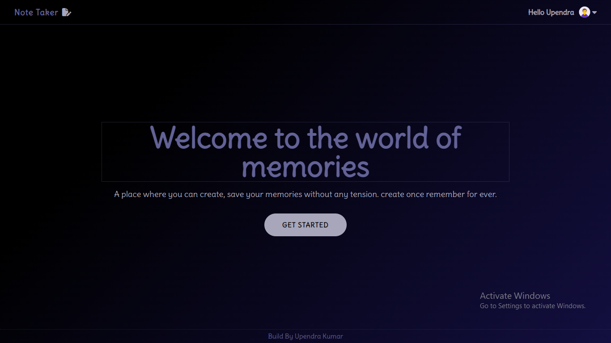
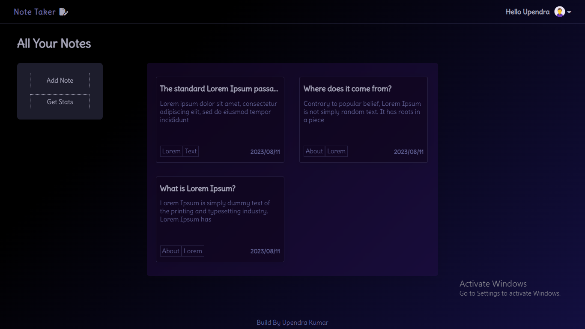
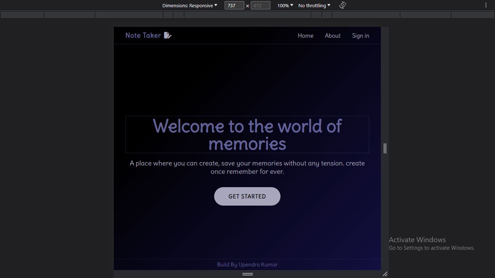
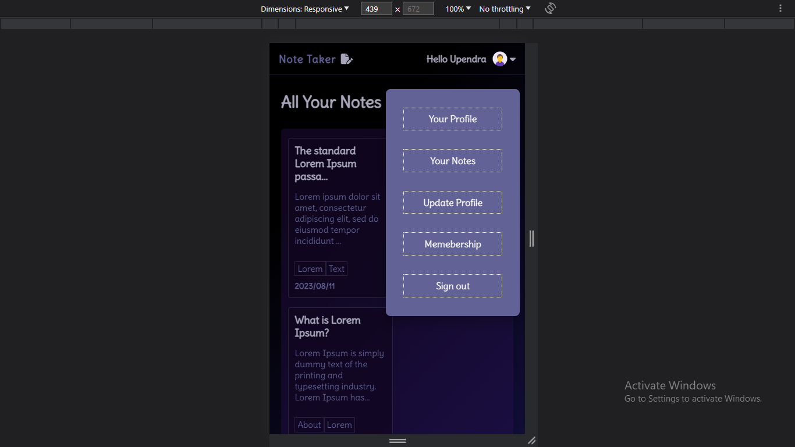
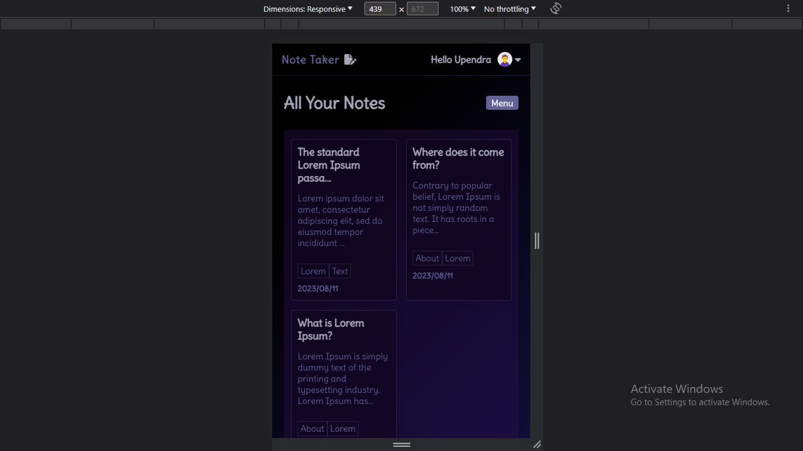

# Note Taker Full Stack Project

The Note Taker is a full-stack web application that allows users to create, view, edit, and delete notes. This project aims to provide an intuitive and user-friendly platform for managing personal notes efficiently.







## Table of Contents

- [Features](#features)
- [Technologies Used](#technologies_used)
- [Getting Started](#getting_started)
- [Prerequisites](#prerequisites)
- [Installation](#installation)
- [Usage](#usage)
- [API Documentation](#api_documentation)
- [Contributing](#contributing)

## Features

- User authentication and authorization.
- Create, view, edit, and delete notes.
- Simple and intuitive user interface.
- Real-time synchronization of notes across devices.
- Robust backend for managing notes securely.

## Technologies Used

- Frontend: ReactJS, CSS 
- Backend: Node.js, Express.js
- Database: MongoDB
- Authentication: JSON Web Tokens (JWT)
- Deployment: Onrender 
- Version Control: Git
- API Calls: Axios

## Getting Started

### Prerequisites

Node.js and npm: Make sure you have Node.js and npm installed. You can download them from [nodejs.org](https://nodejs.org).

### Installation
1. Clone the repository:
```bash
git clone https://github.com/Kr-Upendra/note-taker.git
```

2. Navigate to the project directory:

```bash
cd note-taker
```

3. Navigate to the client directory:

```bash
cd client
```

4. Navigate to the backend directory:

```bash
cd backend
```


5. Install dependencies:

```bash
npm install
```

### Usage
1. Start the server of both:

```bash
npm start
```

2. Open your web browser and navigate to http://localhost:3000 to access the application.

3. Register or log in to start using the note-taking application.

## API Documentation

The Note Taker project includes a RESTful API for managing notes. For detailed API documentation, please refer to the API Documentation file.

## Contributing
Contributions to this project are welcome. To contribute, follow these steps:

1. Fork the repository.
2. Create a new branch for your feature or bug fix.
3. Make your changes and commit them.
4. Push your changes to your fork.
5. Create a pull request.
